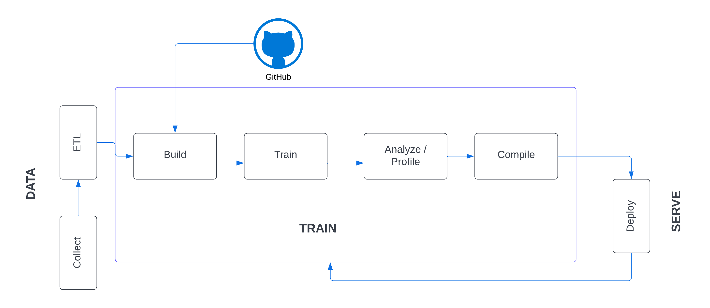

## Background
With roughly one billion monthly active users,Instagram is one of the largest social media platforms.

If you’re running a business account on Instagram, knowing how to increase engagement on your posts and gain real followers on your Instagram account is a must to boost and sustain growth. 

<b>However, gaining real followers is a challenge and time-consuming process.</b>

### What Is Instagram Growth?
Instagram growth essentially refers to increasing traffic to a given Instagram account. There are a number of KPIs that can be used to measure growth, but the most common are follows, likes and comments. 

Ultimately, the goal is to generate additional traffic that will (among other things) increase engagement, establish your brand, get your content seen, enable you to reach new audiences and help you stay a step ahead of the competition.

### Why does it matter? 
1. Getting your content seen on Instagram is the central focus of most IG hacks, courses and services. Instagrammers are interested in what brands have to say. 50% of users follow at least one business, and more than 200 million visit at least one business profile every single day.
2. Instagrammers are consumers, and brands like yours are making sales through Instagram. 60% of users say they discover new products on Instagram, and 80% report that Instagram influences their decision to buy a product or service.

3. Instagram’s user base is not only huge, it’s pretty diverse. This means that growth efforts are critical for brands wanting to market, sell, connect, perform market research, and otherwise make the most of a prime audience.

The right growth strategy can give you a quality audience to connect with, and the authority to do it effectively. 

More followers means greater trust and authority on Instagram. 

A bigger, more engaged follower base can also result in more user generated content and organic word of mouth marketing. Additionally, it offers a greater pool from which to draw insights and perform market research.


<b>This project base your growth using the liking method and analytics.</b> The method provides you with steady growth without putting your accounts at risk. 

It applies the best practices for increasing content engagement on the platform using insights and machine learning models. 

It focuses on the following:
* Optimization of Instagram account
* Post content followers want
* Content consistent with defined Instagram account goals
* Target the right audience
* Post content at the right times to reach the maximum number of target audience 
* Use the right hashtags to optimize for visibility and discoverability

This project is based on a real Instagram account. The statistical analysis and machine learning techniques are used to gain real followers.

## ML project implementation
The project has several important features:
1. Clearly defined problem and target variables in a cleaned dataset.
2. Scraping data from Instagram
3. Utilizing time series modeling to forecast followers based on current activity.
4. A predictive model trained on a portion of the data and tested on a set-aside portion.
5. Evaluation metrics showing the performance of the model on the testing data.
6. Individual results of the testing dataset, for further analysis of incorrect predictions.
7. A feature to receive new user inputs that makes predictions based on the new data.
8. Providing potential reviewers with access to an interactive user interface through a cloud-based platform.


#### Dataset preparation and preprocessing
Data is the foundation for any machine learning project. This stage involves data collection, preprocessing, and transformation.

##### Data collection
The data is collected using [Instaloader](https://instaloader.github.io/).

Instaloader is a tool to download pictures (or videos) along with their captions and other metadata from Instagram. 
It 
* downloads public and private profiles, hashtags, user stories, feeds and saved media,
* downloads comments, geotags and captions of each post,
* is free open source software written in Python.

<i>Scripts to scrape data are not available in this repository.</i>

##### Data preprocessing
The purpose of preprocessing is to convert raw data into a form that fits machine learning. Structured and clean data allows a data scientist to get more precise results from an applied machine learning model. 
The technique includes data formatting, cleaning, and sampling.
[Notebook](https://github.com/piushvaish/instagram-growth-strategy/blob/main/notebooks/gain-followers/01-profile-data-analysis.ipynb)


#### Modeling
During this stage, a data scientist trains numerous models to define which one of them provides the most accurate predictions.

##### Model training
After a data scientist has preprocessed the collected data and split it into three subsets, he or she can proceed with a model training. 

This process entails “feeding” the algorithm with training data. An algorithm will process data and output a model that is able to find a target value (attribute) in new data — an answer you want to get with predictive analysis. 

The purpose of model training is to develop a model.

[Time Series Modeling Notebook](https://github.com/piushvaish/instagram-growth-strategy/blob/main/notebooks/forecast_followers/05_AutoArima.ipynb)

[End-to-End Notebook](https://github.com/piushvaish/instagram-growth-strategy/blob/main/notebooks/gain-followers/04-modelling-evaluation-predictions.ipynb)

#### Model Deployment
Deployment is the method by which you integrate a machine learning model into an existing production environment to make practical business decisions based on data.

[Web Application](https://github.com/piushvaish/instagram-growth-strategy/blob/main/notebooks/dash-app/app.py)

### Setup Environment
```
conda create -n myenv python=3.9
conda activate myenv
pip install -r requirements.txt
python -m ipykernel install --user --name myenv
```
